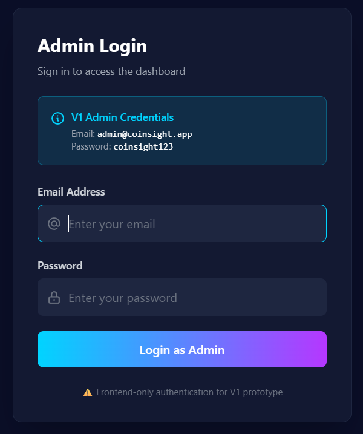
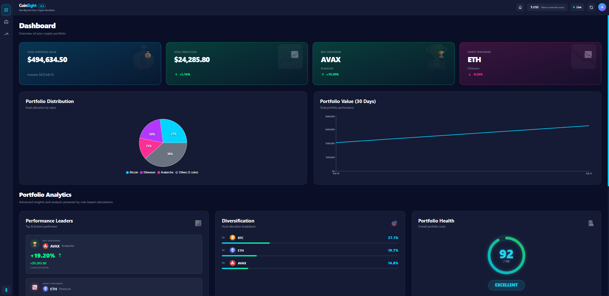
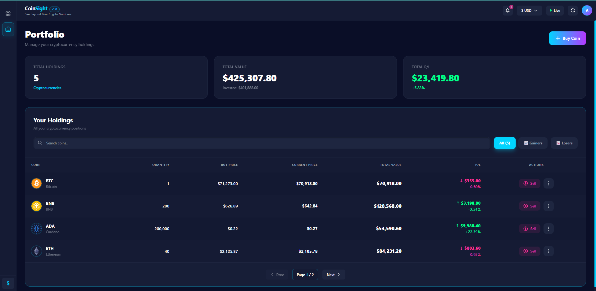
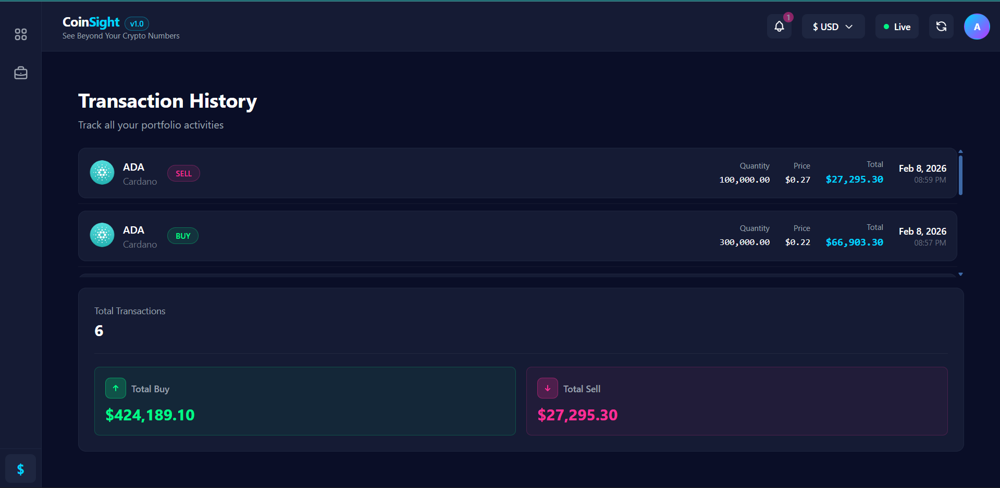
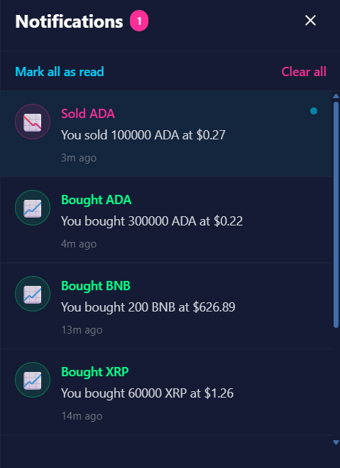
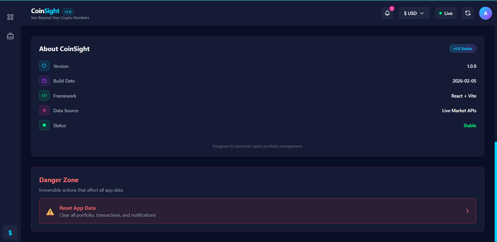

# CoinSight – Crypto Portfolio Analyzer (v1.1)

A professional cryptocurrency portfolio management dashboard with real-time tracking, cloud storage, and advanced analytics. Built with modern web technologies and enterprise-grade security.

## Overview

CoinSight is a production-ready application that enables cryptocurrency investors to monitor, analyze, and manage their portfolios with real-time market data. The platform features secure authentication, cloud database persistence, and comprehensive portfolio analytics with intelligent insights.

## Features

- **Real-time Portfolio Tracking** - Live cryptocurrency prices with automatic 60-second refresh intervals
- **Supabase Cloud Storage** - Persistent database storage with cross-device synchronization
- **Admin Authentication** - Secure email/password authentication with role-based access control
- **Notification System** - Configurable alerts for price changes and portfolio events
- **Transaction History** - Complete audit trail of all buy/sell operations
- **Portfolio Analytics** - Profit/loss tracking, diversification analysis, and health scoring
- **Secure Row-Level Security** - RLS policies ensure users access only their own data
- **Cloud Synced Settings** - User preferences and configurations stored in Supabase
- **Multi-Currency Support** - USD, EUR, and INR with live exchange rates
- **Interactive Visualizations** - Pie charts and historical performance comparisons
- **Data Export** - Export portfolio data for external analysis
- **40+ Cryptocurrencies** - Support for major digital assets

## Tech Stack

**Frontend**
- React 18.3 - Modern UI library
- Vite 6.0 - Next-generation build tool
- Tailwind CSS 3.4 - Utility-first styling

**Backend**
- Supabase - Backend-as-a-Service platform
- PostgreSQL (Supabase) - Relational database
- Row-Level Security (RLS) - Data isolation

**Authentication**
- Supabase Email/Password - Secure user authentication

**Data Visualization**
- Recharts 2.10 - React charting library

**State Management**
- React Context API - Global state management
- React Router DOM 6.21 - Client-side routing

**External APIs**
- CoinGecko API - Real-time cryptocurrency market data
- ExchangeRate API - Live currency conversion rates

## Architecture

CoinSight follows a modern three-tier architecture:

### Frontend Layer
- **React Components** - Modular UI built with functional components and hooks
- **Context Providers** - Global state management for auth, portfolio, and notifications
- **Service Layer** - Abstraction for all backend communication

### Backend Layer
- **Supabase Client** - Centralized client instance in `/supabase/client.js`
- **Authentication** - Managed by Supabase Auth with email/password flow
- **API Services** - Dedicated services for portfolio, transactions, and external APIs

### Database Layer
- **PostgreSQL Tables**:
  - `profiles` - User metadata and roles
  - `holdings` - Current portfolio positions per user
  - `transactions` - Complete transaction history
  - `portfolio_snapshots` - Daily portfolio value tracking
- **Row-Level Security** - Automatic user data isolation with RLS policies
- **Foreign Keys** - Referential integrity between users and data

### Data Flow
```
User Action → React Component → Service Layer → Supabase Client → PostgreSQL
                                      ↓
                            External APIs (CoinGecko, ExchangeRate)
```

### LocalStorage Usage
CoinSight uses localStorage only for:
- **Supabase Auth Session** - Session tokens managed by Supabase SDK
- **One-Time Migration Flag** - Tracks if localStorage data has been migrated to Supabase
- **Reset App Feature** - Clears local cache when user resets application

All portfolio data is stored in Supabase PostgreSQL database.

## Installation

### Prerequisites

Ensure you have the following installed:
- Node.js v18 or higher
- npm or yarn package manager

### Steps

1. Clone the repository:
```bash
git clone https://github.com/krishnikbarman/coinsight-v1.git
cd coinsight
```

2. Install dependencies:
```bash
npm install
```

3. Configure Supabase:
   
   a. Create a free account at [https://supabase.com](https://supabase.com)
   
   b. Create a new project
   
   c. Copy `.env.example` to `.env`:
   ```bash
   cp .env.example .env
   ```
   
   d. Get your credentials from Project Settings > API:
      - Copy the Project URL
      - Copy the anon/public key
   
   e. Update `.env`:
   ```env
   VITE_SUPABASE_URL=your_project_url
   VITE_SUPABASE_ANON_KEY=your_anon_key
   ```

   f. Run the database schema from `supabase-schema.sql` in the Supabase SQL Editor

4. Start the development server:
```bash
npm run dev
```

5. Open your browser at `http://localhost:5173`

6. Register a new account to start tracking your portfolio

## Run Locally

### Development Mode

```bash
npm run dev
```

The application will start on `http://localhost:5173` with hot module replacement enabled.

### Production Build

```bash
npm run build
```

Optimized files will be generated in the `dist/` directory.

### Preview Production Build

```bash
npm run preview
```

## Project Structure

```
coinsight/
├── public/              # Static assets
├── screenshots/         # Application screenshots
├── src/
│   ├── components/      # Reusable UI components
│   ├── pages/          # Route-level page components
│   ├── charts/         # Data visualization components
│   ├── context/        # Context providers (Auth, Portfolio, Notifications)
│   ├── services/       # API integration (portfolio, transaction, crypto, currency)
│   ├── supabase/       # Supabase client configuration
│   ├── utils/          # Helper functions and calculations
│   ├── layouts/        # Layout wrappers (App, Auth)
│   ├── config/         # Configuration files
│   ├── App.jsx         # Root component with routing
│   ├── main.jsx        # Application entry point
│   └── index.css       # Global styles and Tailwind directives
├── .env.example        # Environment variables template
├── supabase-schema.sql # Database schema and RLS policies
├── index.html          # HTML template
├── package.json        # Dependencies and scripts
├── vite.config.js      # Vite configuration
└── tailwind.config.js  # Tailwind CSS configuration
```

## Deployment

CoinSight is deployment-ready and works seamlessly on modern hosting platforms:

### Vercel (Recommended)
```bash
npm install -g vercel
vercel
```

### Netlify
```bash
npm run build
# Deploy the dist/ folder via Netlify dashboard or CLI
```

**Environment Variables**: Ensure `VITE_SUPABASE_URL` and `VITE_SUPABASE_ANON_KEY` are configured in your hosting platform's environment settings.

## Screenshots

### Login Page


### Dashboard Overview


### Portfolio Page


### Transaction History


### Notifications Panel


### Settings & About


## Authentication

CoinSight uses Supabase for secure, production-grade authentication.

**Registration:**
1. Navigate to the login page
2. Click the "Register" tab
3. Enter email and password (minimum 6 characters)
4. Confirm email if required by your Supabase settings

**Login:**
- Use registered email and password
- Sessions persist across browser refreshes
- Automatic token refresh

**Security Features:**
- Passwords hashed and stored securely by Supabase
- JWT-based session tokens
- Protected routes with automatic redirects
- Role-based access control for admin features

## Usage Guide

1. **Register/Login** - Create account or sign in with credentials
2. **Dashboard** - View portfolio overview with real-time analytics and insights
3. **Add Holdings** - Click "Add Coin" to search and add cryptocurrencies to your portfolio
4. **Buy/Sell** - Manage positions with automatic cost averaging calculations
5. **Transaction History** - Review complete audit trail of all operations
6. **Notifications** - Configure alerts for price changes and portfolio events
7. **Settings** - Customize preferences, currency, and export portfolio data

## Browser Compatibility

- Google Chrome (recommended)
- Mozilla Firefox
- Safari
- Microsoft Edge

## Version History

**v1.0 – LocalStorage Prototype**
- Client-side portfolio tracking
- LocalStorage data persistence
- Basic authentication simulation
- Real-time market data integration

**v1.1 – Supabase Backend Migration**
- Migrated to Supabase backend infrastructure
- PostgreSQL database with RLS policies
- Secure email/password authentication
- Cross-device portfolio synchronization
- Transaction history persistence
- Cloud-based settings storage
- Automatic localStorage to Supabase migration
- Production-ready architecture

## Known Limitations

- CoinGecko free tier: 50 API calls per minute
- Historical data: 90-day maximum range
- Email confirmation may be required based on Supabase project settings

## Future Roadmap

- Advanced charting with technical indicators
- Price alerts and threshold notifications
- Portfolio benchmarking against market indices
- CSV import for bulk transaction uploads
- Tax reporting and export functionality
- Exchange API integrations for automatic sync
- Mobile application (React Native)
- WebSocket integration for real-time updates

## License

This project is licensed under the MIT License.

## Author

**Krishnik Barman**  
Email: krishnikbarman12@gmail.com  
GitHub: https://github.com/krishnikbarman

## Acknowledgments

Built with industry-leading technologies and APIs:

- [Supabase](https://supabase.com/) - Backend infrastructure and authentication
- [CoinGecko API](https://www.coingecko.com/en/api) - Cryptocurrency market data
- [ExchangeRate API](https://www.exchangerate-api.com/) - Currency conversion
- [Recharts](https://recharts.org/) - Data visualization
- [Tailwind CSS](https://tailwindcss.com/) - Styling framework
- [React](https://reactjs.org/) - UI library
- [Vite](https://vitejs.dev/) - Build tool

---

**CoinSight v1.1** - Professional Crypto Portfolio Analyzer with Cloud Backend
